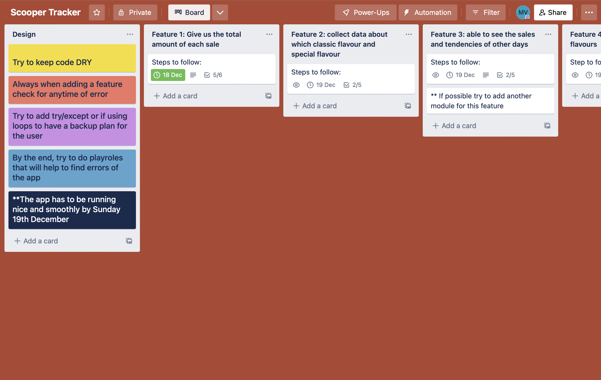

# TERMINAL APPLICATION 
> R4.- Provide a link to your source control repository
 - [__GitHub__](https://github.com/montse-velazquez/Scooper-Tracker)

> R5.- Identify any code style guide or styling conventions that the application will adhere to. Reference the chosen style guide appropriately. 

> R6.- Develop a list of features that will be included in the application. It must include:
> - at least THREE features
> - describe each feature

It will be an app where we will register how many scoops and of which flavour the customer had grabbed his ice cream. 

1. One feature will be the fact that it will give us the total amount of each sale, since there will be customers that might choose different number of scoops which have a different price. 

    - We will complete this task by saving the input of the user since the beginning, and the running a function that will give us out bill, based in which conditions get true so it can print a different price on our screens, aside that this amount will be saving too for another feature. 

2. The app will collect data about which classic flavour  and special flavour the costumers tend to choose usually 

    -  __Working on it__

3. We are going to be able to see the sales and tendencies of other days that were registered 

    - There will be already data saved on the program as a mock up of how it will look like, however by the end of the day when sales are done, we will be able to finish the day by registering the day it is, the sum up of the sales have been being saved on time of each order, using packages of the datetime, and setting it all using different functions together one that saves the sales amount and the other that will allow us to finish the day by just setting the date

4. The list of flavours will be able to be updated at the beginning of the day

    - There will be a function for updating the flavour an deleting the current ones on an easy way, where the user we will just need to type the new flavour into the specials list flavours. 

**The customers will have the chance to choose between 10 classic flavours and 2 specials, the specials will be changed each week.**

>R7.- Develop an implementation plan which:
>- outlines how each feature will be implemented and a checklist of tasks for each feature
>- prioritise the implementation of different features, or checklist items within a feature
>- provide a deadline, duration or other time indicator for each feature or checklist/checklist-item

Link for watching the Project Management: [Scooper Tracker](https://trello.com/invite/b/UqcKMLlY/ATTI68beee69974dc96c428f51f3f0174edf24282A60/scooper-tracker)

>R8.- Design help documentation which includes a set of instructions which accurately describe how to use and install the application. 
